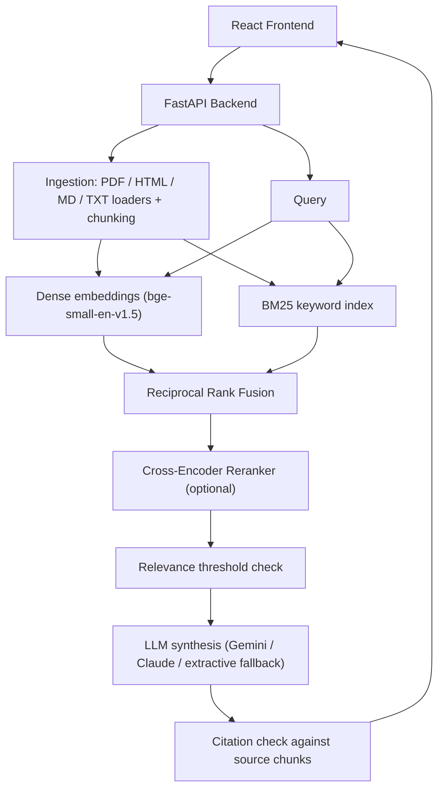

# RAG Document Q&A System

[](https://github.com/Pravarsh05/RAG-Document-Q-A-System/actions/workflows/ci.yml)
[](tests/)
[](app/main.py)
[](rag-frontend/)
[](docker-compose.yml)

A Retrieval-Augmented Generation (RAG) system that goes beyond the typical "embed and cosine-search" tutorial approach. Instead of relying on vector search alone, the project combines **dense embeddings**, **BM25 keyword search**, **rank fusion**, and **cross-encoder reranking**, with a small evaluation harness to measure whether each addition actually helps.

The goal was to learn how real-world RAG pipelines handle retrieval quality, grounding, and failure cases — not just to get a demo working.

---

## Design Motivation

Most beginner RAG projects stop at "chunk documents → embed → cosine similarity → pass to LLM." That approach runs into two recurring problems:

1. **Exact terms getting lost.** Dense embeddings are great at semantic meaning but often miss exact technical tokens — model names, error codes, config flags like `max_connections=500`. Pure vector search can miss the one chunk that has the literal answer.
2. **Topically similar ≠ actually relevant.** A chunk that's generally *about* the right subject can outrank the chunk that actually *answers* the question.

This led to a hybrid retrieval design, which is how production RAG systems typically address the issue:

- **BM25 keyword search** alongside dense embeddings, to catch exact-token matches
- **Reciprocal Rank Fusion (RRF)** to combine the two rankings without needing to normalize incompatible score scales
- **Cross-encoder reranking** as an optional final pass for higher precision on the top candidates

A basic evaluation script was added early on, since "eyeballing" whether changes were improvements stopped being reliable once the pipeline had multiple moving parts.

---

## System Overview



---

## Evaluation Results

A ~100-question benchmark was built (mix of factual questions, paraphrased questions, exact-identifier lookups, and a few unanswerable ones) and run against different pipeline configurations. Numbers below are from that benchmark, measured locally on CPU — not a claim about performance at scale or in production.

| Configuration | Recall@1 | Recall@5 | MRR | Avg Latency |
|---|---|---|---|---|
| Vector-only | 0.95 | 1.00 | 0.973 | 144ms |
| BM25-only | 0.91 | 0.99 | 0.946 | 8ms |
| Hybrid (Vector + BM25) | **0.96** | 1.00 | **0.980** | 146ms |
| Hybrid + Cross-Encoder Rerank | 0.96 | 1.00 | 0.977 | 777ms |

**The most notable result was a negative one:** adding cross-encoder reranking did not improve precision on this benchmark (0.704 vs. 0.718 for hybrid alone), and it added significant latency. This is a useful data point rather than a flaw to hide — a general-purpose reranker that isn't fine-tuned on this kind of technical content doesn't automatically help, and the result is a reminder that added complexity should be measured, not assumed to be an improvement.

The benchmark is small and self-authored, so these numbers shouldn't be read as rigorous ground truth — but running a real evaluation loop surfaced insights that skipping it entirely would have missed.

---

## Areas of Deeper Understanding vs. Lighter Coverage

To be transparent about depth across a fairly large codebase:

**Implemented with a solid grasp of the underlying mechanics:**
- **Reciprocal Rank Fusion:** combines dense and BM25 rankings using `1 / (k + rank)` per method, summed per document. Chosen over min-max score normalization because dense (bounded 0–1) and BM25 (unbounded) scores aren't directly comparable, and RRF only depends on rank position.
- **Relevance threshold gate:** if the top retrieval score is below a set threshold, generation is skipped and the system returns "insufficient evidence" instead of letting the LLM guess.
- **Basic citation checking:** after generation, each claim/citation pair is checked against the chunk it's attributed to, to catch cases where the LLM cites the wrong source.
- **Query rewriting:** strips conversational filler ("can you tell me...") and expands a few known acronyms before retrieval.

**Implemented and tested, but with lighter working knowledge:**
- Multi-tenant request isolation (`X-Tenant-ID` header handling)
- The Redis caching layer and cache-key invalidation scheme
- Some of the file-upload security checks (magic-byte validation, rate limiting)

These are covered by automated tests and function correctly, but would benefit from a closer review before being confidently defended point-by-point.

---

## Tech Stack

| Layer | Tool |
|---|---|
| Backend | FastAPI |
| Vector store | pgvector (Postgres) locally, with a SQLite fallback for easy local runs |
| Keyword search | BM25 (rank_bm25) |
| Embeddings | BAAI/bge-small-en-v1.5 (sentence-transformers) |
| Reranker | cross-encoder/ms-marco-MiniLM-L-6-v2 |
| LLM | Gemini / Claude API, with an offline extractive fallback if no API key is set |
| Cache | In-memory / Redis |
| Frontend | React + Vite + TypeScript |
| Tests | pytest (95 tests across ingestion, retrieval, generation, and API layers) |

---

## Getting Started

### Quickstart (no Docker needed)

```bash
git clone https://github.com/Pravarsh05/RAG-Document-Q-A-System.git
cd RAG-Document-Q-A-System

python -m venv venv
source venv/bin/activate   # Windows: venv\Scripts\activate

pip install -r requirements.txt
uvicorn main:app --reload --port 8000
```

Runs with a SQLite fallback and no external services — good for trying it out quickly.

### Full stack with Docker

```bash
docker-compose up --build -d
```

Spins up Postgres + pgvector, Redis, the FastAPI backend, and the React frontend.

- App: http://localhost:5173
- API docs (Swagger): http://localhost:8000/docs

---

## Running the Evaluation

```bash
python eval/retrieval_experiment.py --limit 100
python eval/run_eval.py --limit 20   # quicker sanity check
```

## Running Tests

```bash
pytest -v
```

---

## Known Limitations

- Cross-encoder reranking is slow on CPU (~700ms P95) and, per the benchmark above, didn't clearly improve precision — a fine-tuned reranker would need to be evaluated before recommending it by default.
- BM25 index is in-memory, which works for small-to-medium document sets but wouldn't scale to very large corpora without an external search engine.
- The extractive fallback (used when no LLM API key is set) produces grounded but not very fluent answers — it exists to avoid hard failures, not as a real substitute for an LLM.
- This has only been tested locally and in CI, not under real production load — the "production" pieces (rate limiting, multi-tenancy) should be treated as a reasonable first pass, not as battle-tested infrastructure.

---

## Possible Next Steps

- Evaluate a reranker fine-tuned on domain-specific documents to see if it improves precision
- Expand the benchmark beyond 100 questions and get it reviewed by someone else
- Add streaming responses so answers appear incrementally instead of all at once

---

## License

MIT
