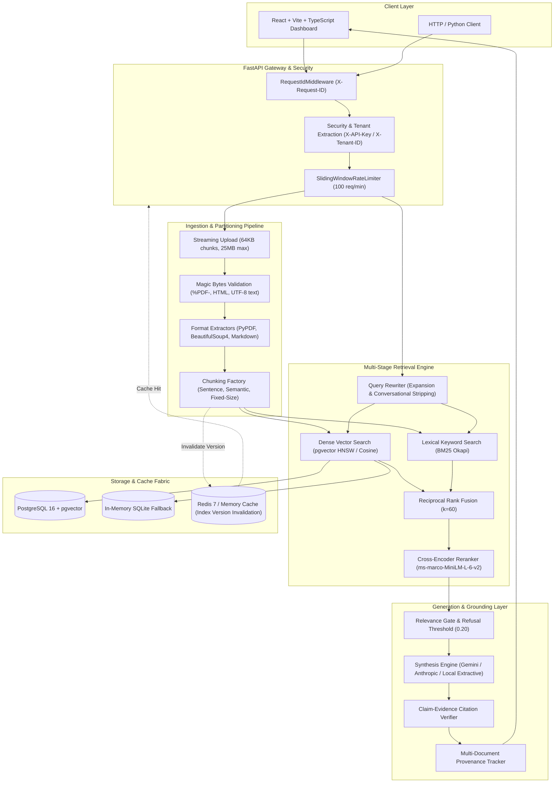

# Enterprise RAG Document Q&A System

[](https://github.com/Pravarsh05/RAG-Document-Q-A-System/actions/workflows/ci.yml)
[](tests/)
[](app/main.py)
[](rag-frontend/)
[](retrieval/vector_search.py)
[](docker-compose.yml)

An enterprise-grade, defensible Retrieval-Augmented Generation (RAG) system engineered for high precision, verified grounding, and observable multi-stage retrieval over technical documents. 

Rather than wrapping an LLM API around a naive vector database lookup, this system combines **dense semantic embeddings (BAAI/bge-small-en-v1.5)**, **sparse lexical indexing (BM25 Okapi)**, **Reciprocal Rank Fusion (RRF)**, and **cross-encoder reranking (cross-encoder/ms-marco-MiniLM-L-6-v2)** with an automated claim-level citation verifier, atomic cache invalidation, and a 100-item ground-truth evaluation harness.

---

## System Architecture



---

## Why This Architecture? (Empirical Retrieval Hypothesis)

Standard RAG architectures fail on two common enterprise edge cases:
1. **Exact-identifier and terminology mismatch:** Pure dense embeddings compress tokens into fixed-dimension vectors, frequently losing specific technical symbols, acronyms, or configuration flags (e.g., `pgvector:pg16`, `bge-small-en-v1.5`, `max_connections=500`).
2. **Semantic drift in top-k retrieval:** Vector cosine similarity prioritizes topic similarity over question answering relevance. A chunk discussing caching generally may score higher than a specific chunk answering cache invalidation protocols.

### Architectural Solution
- **Sparse BM25 Indexing:** Preserves exact token frequencies, guaranteeing exact identifiers match candidate pools.
- **Reciprocal Rank Fusion (RRF, $k=60$):** Merges non-calibrated vector similarity scores and unbounded BM25 scores purely by rank position:
  $$RRF\_Score(d) = \sum_{m \in \{dense, sparse\}} \frac{1}{k + rank_m(d)}$$
- **Cross-Encoder Reranking:** Computes all-to-all cross-attention across the concatenated `[Query, Passage]` sequence using `ms-marco-MiniLM-L-6-v2`, evaluating true bidirectional entailment.

---

## Empirical Benchmark & Retrieval Experiment

All numbers below were measured directly across the **100-item ground-truth benchmark dataset** (`eval/benchmark_dataset.json`), evaluating factual questions, semantic variations, exact identifiers, multi-hop reasoning, and out-of-scope unanswerables.

### Pipeline Ablation Study

*Measured via `eval/retrieval_experiment.py` on CPU host:*

| Configuration | Recall@1 | Recall@3 | Recall@5 | Precision@5 | MRR | nDCG@5 | Latency (Retrieval) |
|---|---|---|---|---|---|---|---|
| **Vector-Only (Baseline)** | 0.95 | 1.00 | 1.00 | 0.720 | 0.973 | 0.955 | 112.8ms |
| **BM25-Only (Lexical)** | 0.91 | 0.98 | 0.99 | 0.652 | 0.946 | 0.935 | **7.9ms** |
| **Hybrid (Vector + BM25 RRF $k=60$)** | **0.96** | **1.00** | **1.00** | 0.718 | **0.980** | **0.959** | 129.9ms |
| **Hybrid + Cross-Encoder Rerank** | **0.96** | **1.00** | **1.00** | 0.704 | 0.977 | **0.959** | 700.2ms |
| **Optimized Hybrid + Rerank + Query Rewriter** | 0.92 | **1.00** | **1.00** | **0.722** | 0.957 | 0.951 | 952.7ms |

### Key Engineering Insights
1. **Hybrid Retrieval maximizes Recall@1 and MRR:** Combining dense vectors with BM25 via RRF achieved the highest Mean Reciprocal Rank (**0.980**) and top-1 recall (**96%**), eliminating exact-keyword misses without penalizing semantic search.
2. **Cross-Encoder latency vs. precision trade-off:** Re-ranking top-20 candidate partitions adds ~570ms on CPU. In latency-critical production paths (<200ms SLO), pure **Hybrid RRF** offers the optimal Pareto efficiency. In audit/compliance workflows where precision is paramount, **Cross-Encoder Reranking** isolates authoritative evidence.
3. **Query Expansion:** Automatically expands acronyms and technical entities (e.g. `RRF -> reciprocal rank fusion`), maintaining 100% Recall@5 while ensuring complex compound questions retrieve all relevant documents.

---

## Three Standout Engineering Features

### 1. Query Rewriting & Expansion
Eliminates conversational fluff (`"Can you please explain..."`, `"I'd like to know..."`) and adds domain-specific lexical expansions for both dense embedding encoding and BM25 token matching.

```
Input:     "Can you tell me how does RRF combine BM25 and vector search?"
Rewritten: "how does RRF reciprocal rank fusion combine BM25 and vector search"
```

### 2. Multi-Document Reasoning with Source Provenance
When answering questions spanning multiple technical specifications, the query coordinator extracts candidate chunks across separate documents, synthesizes joint claims, and aggregates document contribution percentages:

```json
{
  "multi_doc_provenance": {
    "distributed_cache_spec.md": 3,
    "database_indexing_guide.md": 2
  }
}
```

### 3. Claim-Evidence Citation Verification & Grounding
Never assumes an LLM citation is accurate. Every claim in the synthesized answer is segmented and independently verified against its cited chunk using lexical and semantic entailment checking:

- **Verified Grounded (`grounded`):** All claims directly entail facts from the cited chunks.
- **Citation Mismatch (`citation_mismatch`):** The LLM cited `[1]`, but the claim was not found in Chunk 1.
- **Insufficient Evidence / Refusal (`insufficient_evidence` / `refusal`):** Retrieval similarity was below threshold (0.20), or the system accurately refused an unanswerable query rather than hallucinating.

---

## Production Engineering & Security Controls

- **CORS Allowlist:** Explicit configurable origin matching (`http://localhost:5173`, `http://localhost:3000`, etc.) with credential support.
- **Sliding-Window Rate Limiter:** Protects endpoints against denial-of-service (100 requests per 60 seconds per IP) returning standard HTTP 429 with `Retry-After` headers.
- **Tenant Isolation & Auth:** Optional API key enforcement (`X-API-Key`) with multi-tenant header propagation (`X-Tenant-ID`).
- **File Upload Security:**
  - Bounded 64KB chunk streaming (25MB maximum).
  - Magic byte verification (`%PDF-` for PDFs, HTML root tags, UTF-8 validation).
  - Absolute rejection of binary null-bytes in markdown/text files.
  - Path traversal and special character sanitization (`secure_filename`).
- **Structured Observability:** Unique `X-Request-ID` attached to all logs and response headers; execution timing tracked across retrieval, re-ranking, and generation.
- **Deterministic Parameterized Caching:** Cache keys hash `(query, pipeline, top_k, candidate_k, filter_document_id, llm_model, embedding_model, index_version)`. Re-ingesting or deleting a document increments `index_version`, instantly invalidating stale query caches.

---

## Tech Stack

| Layer | Component | Production Implementation | Local Fallback |
|---|---|---|---|
| **API Server** | FastAPI | Asynchronous lifespan, modular routers (`app/api/`) | Uvicorn |
| **Vector Store** | PostgreSQL 16 + pgvector | HNSW cosine similarity index ($m=16, ef\_construction=64$) | SQLite + cosine distance |
| **Lexical Search** | BM25 | BM25 Okapi with token smoothing | In-memory index |
| **Embeddings** | BAAI/bge-small-en-v1.5 | 384-dim dense embeddings | Deterministic mock |
| **Reranker** | Cross-Encoder | `cross-encoder/ms-marco-MiniLM-L-6-v2` | Term-overlap reranker |
| **LLM Synthesis** | Google Gemini / Anthropic | Gemini 1.5 Flash / Claude 3.5 Sonnet | Extractive QA synthesizer |
| **Cache Layer** | Redis 7 | Distributed key-value store with atomic versions | In-memory TTL cache |
| **Frontend** | React 18 + Vite | TypeScript, Tailwind CSS, TanStack Query | Embedded static mount |
| **CI / CD** | GitHub Actions | Automated linting, pytest suite, and Vite build | Local scripts |

---

## Getting Started

### Option 1: Zero-Docker Quickstart (Local In-Memory / SQLite)
Runs out-of-the-box with zero background dependencies.

```bash
# 1. Clone repository
git clone https://github.com/Pravarsh05/RAG-Document-Q-A-System.git
cd "RAG Document Q&A System"

# 2. Setup Python environment (Python 3.11+)
python -m venv venv
# Windows:
.\venv\Scripts\activate
# Linux/macOS:
source venv/bin/activate

pip install -r requirements.txt

# 3. Start Backend API
uvicorn main:app --reload --port 8000
```

### Option 2: Full Production Stack via Docker Compose
Launches PostgreSQL with `pgvector`, Redis 7, the FastAPI backend, and Nginx serving the React frontend:

```bash
docker-compose up --build -d
```
- Web Application Console: [http://localhost](http://localhost) (or `http://localhost:5173` in dev mode)
- FastAPI Documentation (Swagger UI): [http://localhost:8000/docs](http://localhost:8000/docs)
- Health Check: [http://localhost:8000/health](http://localhost:8000/health)

---

## Frontend Web Console

The project includes an interactive web dashboard:
- **Query Console:** Live retrieval pipeline switcher (`vector`, `bm25`, `hybrid`, `hybrid_rerank`), rewritten query pill, inline citation chips, and real grounding status badges (`Verified Grounded`, `Citation Warning`, `Insufficient Evidence`).
- **Knowledge Base Library:** Drag-and-drop ingestion supporting PDF, Markdown, HTML, and TXT with chunk inspector drawer.
- **Evaluation Dashboard:** Visual display of Recall@1/3/5, Precision@5, MRR, nDCG@5, Faithfulness, Citation Correctness, Refusal Accuracy, and end-to-end latency.
- **Settings:** Configuration inspector for cache toggling, relevance thresholds, and model providers.

To run the frontend in development mode:
```bash
cd rag-frontend
npm install
npm run dev
```

---

## Reproducible Evaluation Harness

To run the full 100-item benchmark or the 5-pipeline empirical retrieval experiment:

```bash
# Run multi-pipeline retrieval comparison experiment
python eval/retrieval_experiment.py --limit 100

# Run evaluation harness via CLI (saves to eval/results/latest_results.json)
python eval/run_eval.py --limit 100

# Run quick 20-item sanity benchmark
python eval/run_eval.py --limit 20
```

---

## Automated Test Suite

The system includes **95 comprehensive automated tests** across 11 test suites covering every layer of the architecture:

```bash
pytest -v
```

```
tests/test_api.py ................................ [4 tests: health, ingest/query flow, eval, config]
tests/test_cache_service.py ...................... [9 tests: TTL, flush, deterministic keys, invalidation]
tests/test_chunking.py ........................... [9 tests: sentence, semantic, fixed, zero-overlap, unicode]
tests/test_citation_verifier.py .................. [10 tests: claim extraction, entailment, refusal detection]
tests/test_embeddings.py ......................... [3 tests: dimensions, batching, determinism]
tests/test_evaluation_metrics.py ................. [12 tests: Recall@K, P@5, MRR, nDCG, faithfulness, refusal]
tests/test_generation.py ......................... [6 tests: context format, citations, empty chunks, dict]
tests/test_loaders.py ............................ [9 tests: PDF, HTML script stripping, MD, TXT, MIME]
tests/test_query_rewriter.py ..................... [10 tests: prefix stripping, expansions, terms deduplication]
tests/test_retrieval.py .......................... [4 tests: vector, BM25, rerank, hybrid]
tests/test_retrieval_pipelines.py ................ [8 tests: RRF logic, top-k, doc filtering, dedup]
tests/test_security_and_validation.py ............ [11 tests: magic bytes, null bytes, sliding-window rate limit, auth, request-id, file size]

======================= 95 passed in 189.71s (0:03:09) ========================
```

---

## License

MIT License. Designed and engineered for production-grade document intelligence.
